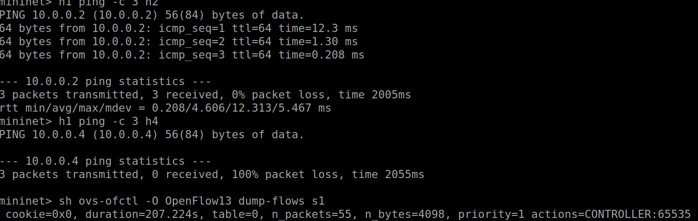
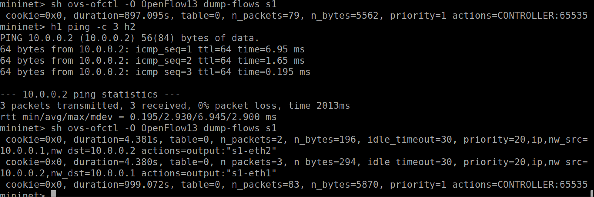
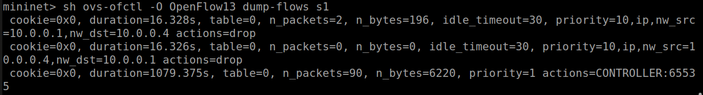
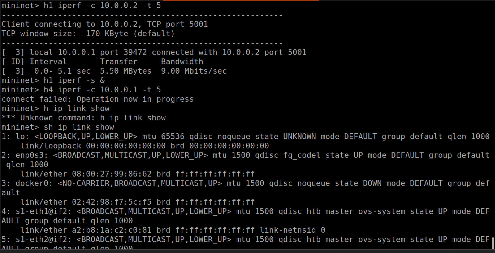
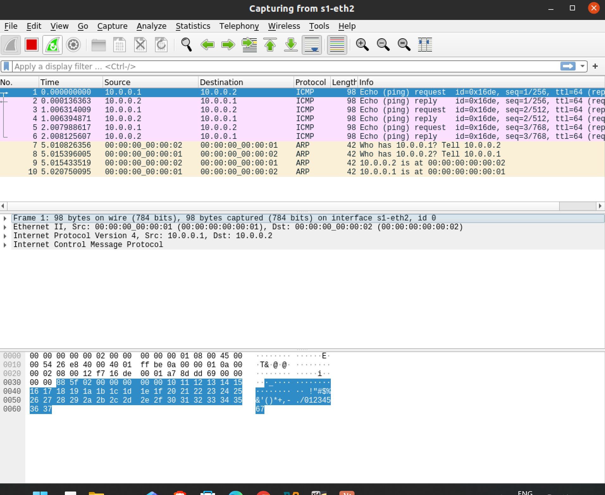
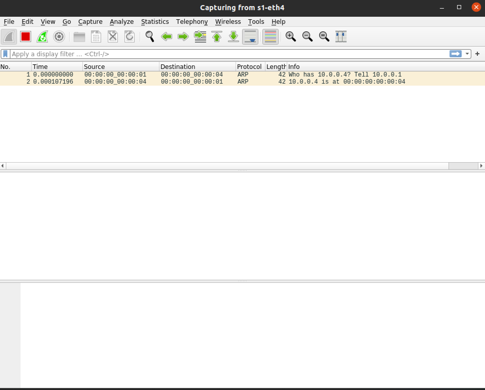

# SDN-Based Access Control System

**Course:** Computer Networks / SDN Lab  
**Project:** #11 – SDN Based Access Control System  
**Tool Used:** Mininet + Ryu Controller (OpenFlow 1.3)

---

## What is this project about?

In this project I implemented an SDN-based Access Control System using Mininet and the Ryu OpenFlow controller. The main idea is to only allow certain hosts to communicate with each other and block everyone else. This is done by maintaining a whitelist of authorized hosts and installing flow rules (allow/deny) on the switch using OpenFlow.

---

## Network Topology

I used a simple topology with 1 switch and 5 hosts:

```
    h1 (10.0.0.1)  ──┐
    h2 (10.0.0.2)  ──┤
    h3 (10.0.0.3)  ──┼──  s1 (OVS Switch)  ──── Ryu Controller
    h4 (10.0.0.4)  ──┤               
    h5 (10.0.0.5)  ──┘
```

| Host | IP Address | Status |
|------|-----------|--------|
| h1 | 10.0.0.1 | Authorized |
| h2 | 10.0.0.2 | Authorized |
| h3 | 10.0.0.3 | Authorized |
| h4 | 10.0.0.4 | NOT Authorized |
| h5 | 10.0.0.5 | NOT Authorized |

**Whitelist (who can talk to who):**
- h1 ↔ h2 ✅
- h1 ↔ h3 ✅
- h2 ↔ h3 ✅
- h4 and h5 are blocked from everyone ❌

---

## How it Works

The Ryu controller handles every `packet_in` event:

1. If the packet is **ARP** → flood it (needed for MAC resolution)
2. If the packet is **IPv4** → check if source and destination are in the whitelist
   - If **yes** → install ALLOW rule (priority 20) and forward the packet
   - If **no** → install DROP rule (priority 10) and discard the packet

Flow rules are bidirectional so both directions are covered automatically.

---

## Files in this Repo

```
SDN-Based-Access-Control-System/
├── access_control.py       # Ryu controller – main logic
├── run_tests.py            # automated test script
└── README.md
```

---

## Proof of Execution

### 1. Ping Test – Allowed vs Blocked

**h1 ping h2 (Allowed) and h1 ping h4 (Blocked):**



---

### 2. Flow Table – ALLOW Rules (after h1 ping h2)



---

### 3. Flow Table – DROP Rules (after h1 ping h4)



---

### 4. iperf – Allowed Pair (h1 → h2) and Blocked Pair (h4 → h1)



---

### 5. Wireshark – Allowed Traffic (s1-eth2)
ICMP request and reply visible between h1 and h2 – traffic is flowing normally.



---

### 6. Wireshark – Blocked Traffic (s1-eth4)
Only ARP packets visible – no ICMP at all. The DROP rule is working correctly.


---

## Test Scenarios

### Scenario 1 – Allowed vs Blocked (Ping)

| Test | Expected | Result |
|------|----------|--------|
| h1 ping h2 | Success (0% loss) | ✅ Pass |
| h1 ping h3 | Success (0% loss) | ✅ Pass |
| h2 ping h3 | Success (0% loss) | ✅ Pass |
| h1 ping h4 | Fail (100% loss) | ✅ Pass |
| h1 ping h5 | Fail (100% loss) | ✅ Pass |
| h4 ping h1 | Fail (100% loss) | ✅ Pass |

### Scenario 2 – Throughput (iperf)

| Test | Expected | Result |
|------|----------|--------|
| h1 iperf to h2 | Bandwidth > 0 | ✅ ~9 Mbits/sec |
| h4 iperf to h1 | Connection fail | ✅ connect failed |

### Scenario 3 – Regression Test (Policy Consistency)

After the flow rules are installed I re-ran the ping tests and checked the flow table again to make sure the rules were still correctly applied and nothing changed. Results were consistent with Scenario 1.

---

## Observations

- First ping is slightly slower (goes to controller first) then subsequent pings are faster once the flow rule is installed
- DROP rules are also bidirectional so h4 cant reach h1 AND h1 cant reach h4
- idle_timeout=30 means rules expire after 30 seconds of no traffic which is expected behavior
- Wireshark clearly shows the difference between allowed and blocked traffic